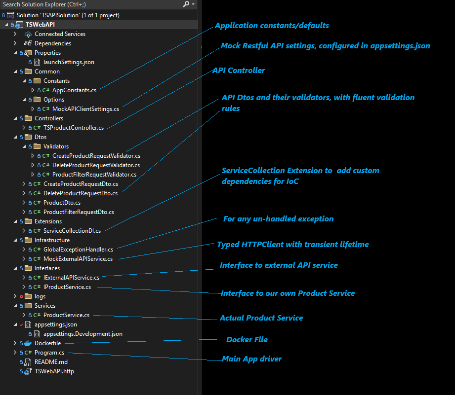
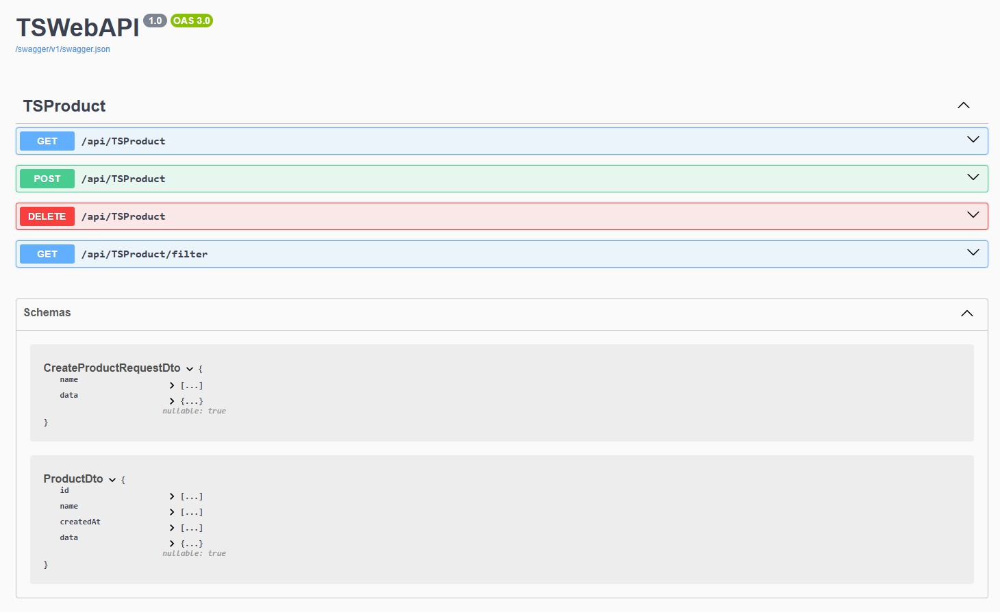

# TS API Coding Task

## _RESTful Web API using .NET 8_

## Solution Architecture

I generally prefer using Clean Architecture for my API projects. However, since this is a simple and small project, I opted for a folder-based structure to maintain separation of concerns and define dependency layers.

Because there are only a few controllers and endpoints, I chose not to use MediatR (also considering its change in license type, I'm avoiding it in new projects).

For logging, I used **Serilog** with only Console and File sinks. In a commercial project, I would have used Serilog with Seq or Elastic sink, or prefered using **OpenTelemetry** for logging and telemetry data collection.

For input validation, I used **FluentValidation** with simple rule definitions.

To easily manage the status of Mock API calls to my API Controller,I used Result pattren via the **Ardalis.Result** library. This library provides a simple way to handle success and failure results, making it easier to manage the flow of data and errors in the application.

To make external HTTP calls to the mock API, I used a **typed HTTP client** (`MockExternalAPIService : IExternalAPIService`).

For JSON serialization and deserialization, I chose **Newtonsoft.Json**, as there were some scenarios where it provided better flexibility than the default .NET JSON library.

The mock RESTful API returns JSON responses where the `data` property contains key-value pairs depending on the product type. Here keys are always string, but value types vary depending upon (key)attribute type. Example:
```json
{
  "data": {
    "year": 2019,
    "price": 1849.99,
    "CPU model": "Intel Core i9",
    "Hard disk size": "1 TB",
 }
}
```
To deserialize this loosely typed data, I used:
```csharp
Dictionary<string, object>? Data { get; init; }

```
### Project Structure Overview




### API Endpoints/Methods

The `TSProductController` contains the following endpoints:

-   `[GET] /api/TSProduct` – Retrieves all products.
    
-   `[GET] /api/TSProduct/filter` – Retrieves filtered products based on `name`, `pageNo`, and `pageSize`. If `name` is null or empty, all products are returned.
    
-   `[POST] /api/TSProduct` – Creates a new product.
    
-   `[DELETE] /api/TSProduct` – Deletes a product by the provided `productId`.



### Validation

The **FluentValidation** library is used for all incoming request DTO validations. This is handled in the service layer within the `ProductService` class. The class first checks the validation status of the request DTO; if validation fails, it returns an invalid result. Otherwise, it proceeds to call the external API.

### Error Handling

The `ProductService` class wraps all external API calls in a `try/catch` block. Based on the outcome, it returns the appropriate result to the controller. To send responses to the user, I used the **Result pattern** via the `Ardalis.Result` library.
Beasides that there is Global Exception Handler middleware that handles all unhandled exceptions and returns a generic error message to the user. This middleware is registered in the `Program.cs` file.

### Tests
I didn't implement any unit or/and integration tests, considering it out of scope for this task. However, I would have used **xUnit** for unit testing and **FluentAssertions** for assertions. For integration tests, I would have used **FluentAssertions** and **Microsoft.AspNetCore.Mvc.Testing**.
